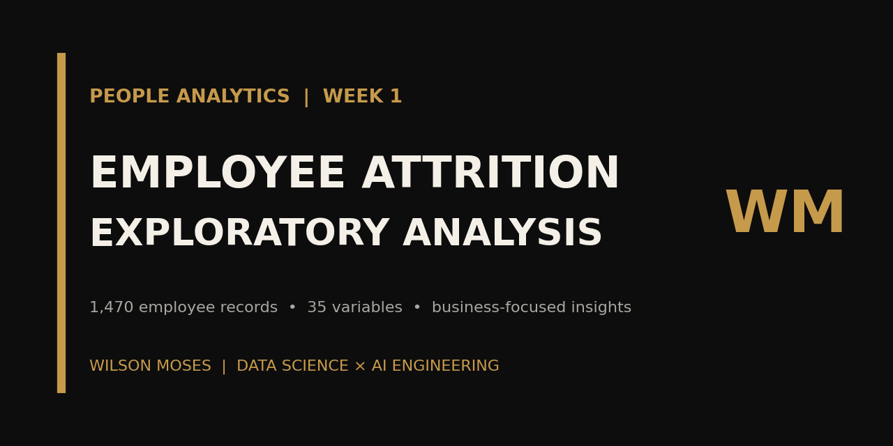
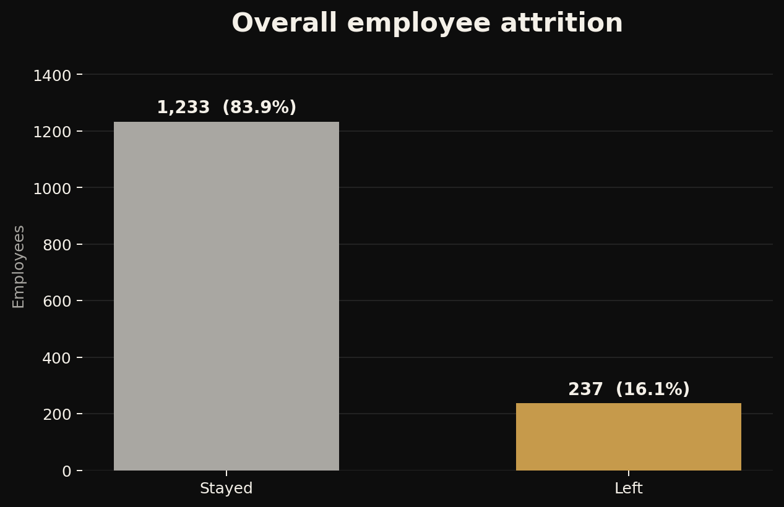
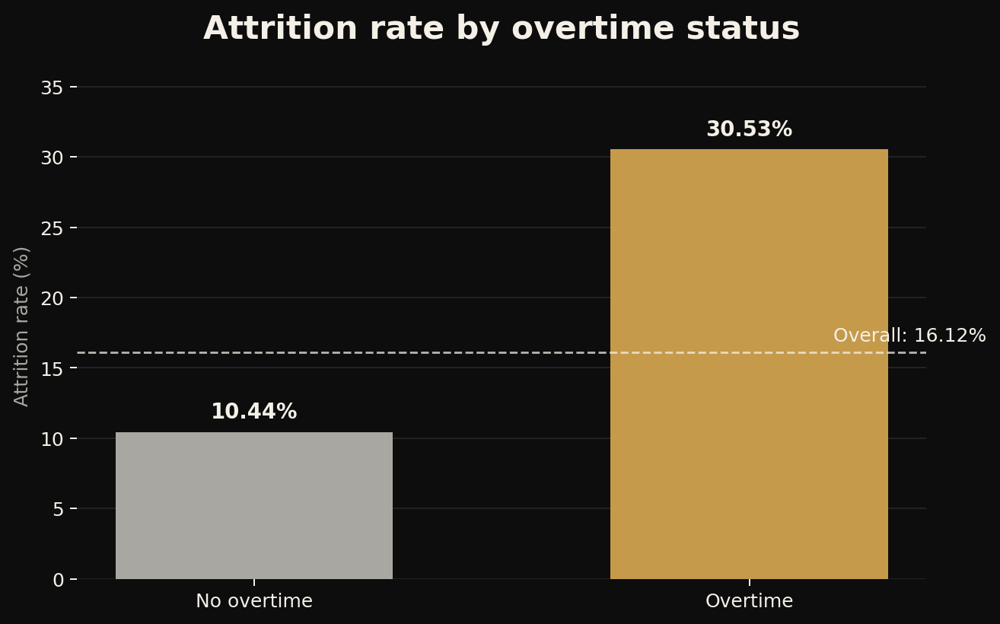
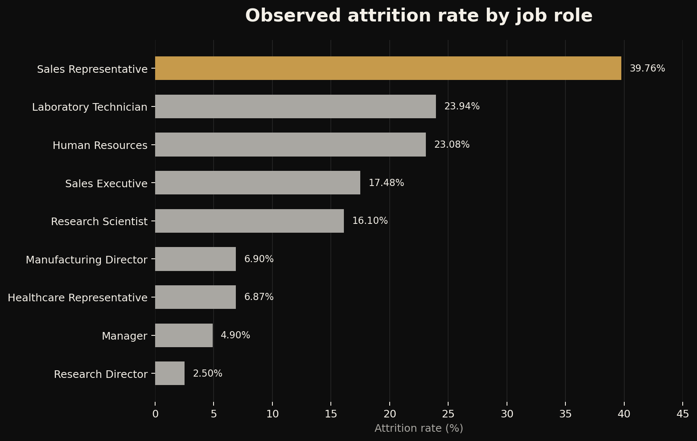

<p align="center">
  
</p>

<p align="center">
  <a href="https://www.linkedin.com/in/wilson-moses-9207b22bb">LinkedIn</a>
  ·
  <a href="https://github.com/WilsonMoses-Data">GitHub</a>
  ·
  <a href="https://www.tiktok.com/@moses.learnsdata">Moses Learns Data</a>
</p>

# Employee Attrition Analysis

> Exploratory analysis of 1,470 employee records to identify workforce attrition patterns and establish evidence for future statistical and predictive work.



## Project snapshot

| Project detail | Information |
|---|---|
| Domain | People Analytics |
| Context | AnalystLab Africa Data Science Internship — Week 1 |
| Status | Completed exploratory analysis |
| Dataset | 1,470 employee records and 35 variables |
| Target | `Attrition` — Yes or No |
| Core tools | Python, pandas, NumPy, Matplotlib, Seaborn and Jupyter Notebook |
| Deliverables | Two notebooks, a presentation, reproducible visuals and project documentation |

## Project overview

ABC Manufacturing Ltd wants to understand employee attrition before investing in predictive modelling. This project examines workforce composition and compares attrition across overtime status, departments, job roles, age, income and experience.

The work is descriptive and exploratory. It identifies associations and priority questions; it does not claim that the observed factors cause employees to leave.

## Business questions

1. What does the workforce look like?
2. Which departments and job roles have the highest attrition rates?
3. How does overtime relate to attrition?
4. How do age, monthly income and total working experience differ between employees who stayed and left?
5. Which variables warrant future statistical testing and predictive modelling?

## Dataset

- **Source:** [IBM HR Analytics Employee Attrition & Performance — Kaggle](https://www.kaggle.com/datasets/pavansubhasht/ibm-hr-analytics-attrition-dataset)
- **Rows:** 1,470 employee records
- **Variables:** 35
- **Target:** `Attrition` (`Yes`/`No`)
- **Missing values:** 0
- **Exact duplicate rows:** 0

The fields cover demographics, compensation, work characteristics, satisfaction measures, job roles and tenure. See the [data documentation](data/README.md) for usage and licensing notes.

## Analytical workflow

1. Loaded and inspected the dataset.
2. Validated dimensions, data types, missingness, duplicates and categorical values.
3. Summarised workforce composition.
4. Visualised distributions for age, income and working experience.
5. Calculated overall and subgroup attrition rates.
6. Compared employees who stayed with those who left.
7. Translated the patterns into business insights and future analytical questions.

## Key findings

| Finding | Evidence |
|---|---|
| Overall attrition | 237 of 1,470 employees; **16.12%** |
| Overtime | **30.53%** attrition with overtime vs. **10.44%** without overtime |
| Department | Sales **20.63%**, Human Resources **19.05%**, R&D **13.84%** |
| Highest-attrition role | Sales Representative **39.76%** |
| Age | Employees who left averaged **33.61 years** vs. **37.56 years** for those who stayed |
| Monthly income | Employees who left averaged **4,787.09** vs. **6,832.74** for those who stayed |
| Total working years | Employees who left averaged **8.24 years** vs. **11.86 years** for those who stayed |

Overtime is the clearest descriptive signal in this analysis, but it should be examined alongside job role, department, travel, satisfaction and tenure before any intervention is designed.

## Visual results

### Overall attrition



### Overtime and attrition



### Attrition by job role



## Business recommendations

- Review overtime practices and workload concentration, especially in roles with high attrition.
- Investigate Sales Representative working conditions, onboarding, management support and career progression.
- Segment future analysis by role and department to avoid broad company-wide conclusions.
- Combine the dataset with interviews, exit feedback and operational context.
- Validate the observed relationships statistically before using them for policy or prediction.

## Repository structure

```text
employee-attrition-analysis/
├── README.md
├── LICENSE
├── requirements.txt
├── data/
│   ├── README.md
│   └── raw/
│       └── abc_employee_attrition.csv
├── images/
│   ├── job-role-attrition-rate.png
│   ├── overall-attrition.png
│   ├── overtime-attrition-rate.png
│   ├── social-preview.png
│   └── wilson-moses-banner.png
├── notebooks/
│   ├── 01_data_loading_and_inspection.ipynb
│   └── 02_exploratory_attrition_analysis.ipynb
├── reports/
│   └── employee_attrition_findings_and_insights.pptx
└── scripts/
    └── generate_readme_visuals.py
```

## Run locally

```bash
git clone https://github.com/WilsonMoses-Data/employee-attrition-analysis.git
cd employee-attrition-analysis

python -m venv .venv
```

Activate the environment:

```bash
# Windows
.venv\Scripts\activate

# macOS or Linux
source .venv/bin/activate
```

Install the dependencies and start Jupyter:

```bash
python -m pip install --upgrade pip
pip install -r requirements.txt
jupyter notebook
```

Run the notebooks in numerical order. The notebook paths are already configured for the repository structure.

To regenerate the README visuals:

```bash
python scripts/generate_readme_visuals.py
```

## Assumptions, limitations and responsible use

- The data is cross-sectional and does not establish causation.
- The analysis does not yet control for interactions among overtime, role, income, tenure and other factors.
- Several employee-experience variables are self-reported or ordinal.
- Findings from the public IBM dataset may not generalise to another company without local validation.
- Any future model should be evaluated for fairness and should support—not replace—human HR judgement.
- Original code and documentation are covered by the repository licence; the dataset remains subject to its original source terms.

## Skills demonstrated

- Business-question translation
- Data loading and quality inspection
- Exploratory data analysis
- Categorical and numerical comparison
- Data visualisation
- Business interpretation
- Responsible analytical communication
- Reproducible project documentation

## Learning reflection

This first internship project strengthened my ability to move from a broad business concern—employee attrition—to specific analytical questions and evidence. The most important lesson was that a strong descriptive pattern is a starting point for investigation, not proof of causation.

## Next steps

- Apply statistical tests and effect-size measures to priority relationships.
- Build a multivariate analysis that separates overlapping factors.
- Investigate class imbalance before predictive modelling.
- Compare models using metrics appropriate for attrition risk.
- Evaluate subgroup performance and fairness before operational use.

## Author

**Wilson Moses**  
Developing Data Scientist × AI Engineer based in Botswana

[LinkedIn](https://www.linkedin.com/in/wilson-moses-9207b22bb) · [GitHub](https://github.com/WilsonMoses-Data) · [Moses Learns Data](https://www.tiktok.com/@moses.learnsdata)

---

<p align="center"><strong>Learning. Building. Applying.</strong></p>
